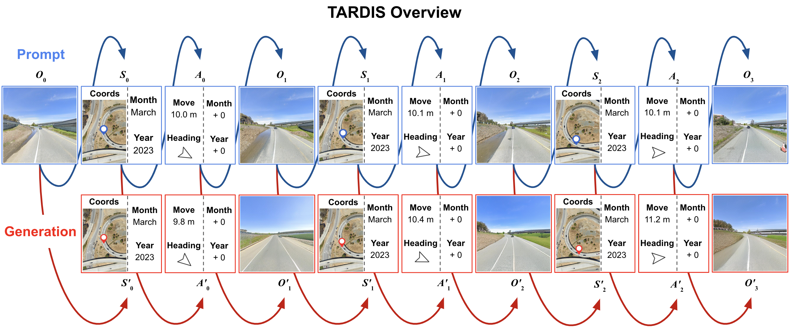

<p align="center">
  <h1 align="center">TARDIS STRIDE: A Spatio-Temporal Road Image Dataset for Exploration and Autonomy</h1>
  <div align="center">
    
  </div>
  <p align="center">
    <a href="https://hectorcarrion.com"><strong>Héctor Carrión*</strong></a>
    ·
    <a href="https://yutongbai.com"><strong>Yutong Bai*</strong></a>
    ·
    <a href="https://vhernandez.me"><strong>Víctor A. Hernández Castro*</strong></a>
    ·
    <a href="https://scholar.google.com/citations?user=yTCoJdsAAAAJ"><strong>Kishan Panaganti</strong></a>
    ·
    <a href="https://trangml.com"><strong>Matthew Trang</strong></a>
    ·
    <a href="https://ayushzenith.me"><strong>Ayush Zenith</strong></a>
    ·
    <a href="#"><strong>Tony Zhang</strong></a>
    ·
    <a href="#"><strong>Pietro Perona</strong></a>
    ·
    <a href="#"><strong>Jitendra Malik</strong></a>
  </p>
  <p align="center">(* equal contribution)</p>
  <h3 align="center">
    <a href="#">Paper (TBD)</a> | <a href="https://huggingface.co/datasets/Tera-AI/STRIDE">Dataset</a>
  </h3>
</p>

# Getting Started

## Installation

### Conda
Check your system's CUDA version with nvcc
```bash
nvcc --version
```

Create and activate virtual environment with required Python dependencies:
```bash
conda env create -f gpu_environment.yml tardis
conda activate tardis
```

### Docker
Another approach is to build from our Dockerfile:
```bash
docker build -f Dockerfile --platform=linux/amd64 -t tardis .
```

## Downloading Dataset
The full tokenized dataset is made available through two downloadable files in a public GCS bucket:
```bash
gsutil -m cp gs://tera-tardis/STRIDE-1/training.jsonl . # ~327GB
gsutil -m cp gs://tera-tardis/STRIDE-1/testing.jsonl . # ~9GB
```

## Weights
The checkpoint/state used for evaluation of the model was saved in MessagePack format and is made available through this downloadable file:
```bash
gsutil -m cp gs://tera-tardis/STRIDE-1/checkpoint.msgpack . # ~10GB
```

## Training

### Single VM
To train on a single VM, you may use this script:
```bash
EasyLM/scripts/train.sh
```

### Distributed (Kubernetes)
To train using Kubernetes, submit the Kubernetes Job as stated in [.kubernetes/setup-cluster.sh](.kubernetes/setup-cluster.sh).


## Testing

### Single VM
We only provide evaluation code for single VM configuration, as supposed to distributed solutions.
```bash
gsutil -m cp -r cp gs://tera-tardis/STRIDE-1/checkpoint.msgpack .
python -m EasyLM.models.llama.convert_easylm_to_hf \
    --load_checkpoint='trainstate_params::checkpoint.msgpack' \
    --model_size='vqlm_1b' \
    --output_dir='.'
```

For a more detailed breakdown of eval, please see [this notebook](eval.ipynb)

## Safeguards
The dataset itself consists of Google StreetView data which has been thoroughly cleansed and blurred to protect the privacy of citizens, and is free of any ill-intent, nudity and sensitive information. For more information, refer to [their policy](https://www.google.com/streetview/policy/).

## Contacts
* [Héctor Carrión](mailto:hector@tera.earth)
* [Yutong Bai](mailto:ytongbai@gmail.com)
* [Víctor A. Hernández Castro](mailto:vhernandezcastro@gmail.com)
* [Kishan Panaganti](mailto:kpb@caltech.edu)
* [Ayush Zenith](mailto:ayush@tera-ai.com)
* [Matthew Trang](mailto:matthew@tera.earth)
* [Tony Zhang](mailto:tony@tera-ai.com)
<!-- * [Pietro Perona](mailto:) -->
<!-- * [Jitendra Malik](mailto:) -->

## Citation
If you found this code/work to be useful in your own research, please consider citing as follows:
```
@article{2025_tardis_stride,
    title={TARDIS STRIDE: Spatio-temporal World Modeling for Real-world Autonomous Systems},
    author={Héctor Carrión, Yutong Bai, Víctor A. Hernández Castro, Kishan Panaganti, Ayush Zenith, Matthew Trang, Tony Zhang, Pietro Perona, Jitendra Malik},
    journal={TBD preprint},
    year={2025},
}
```
